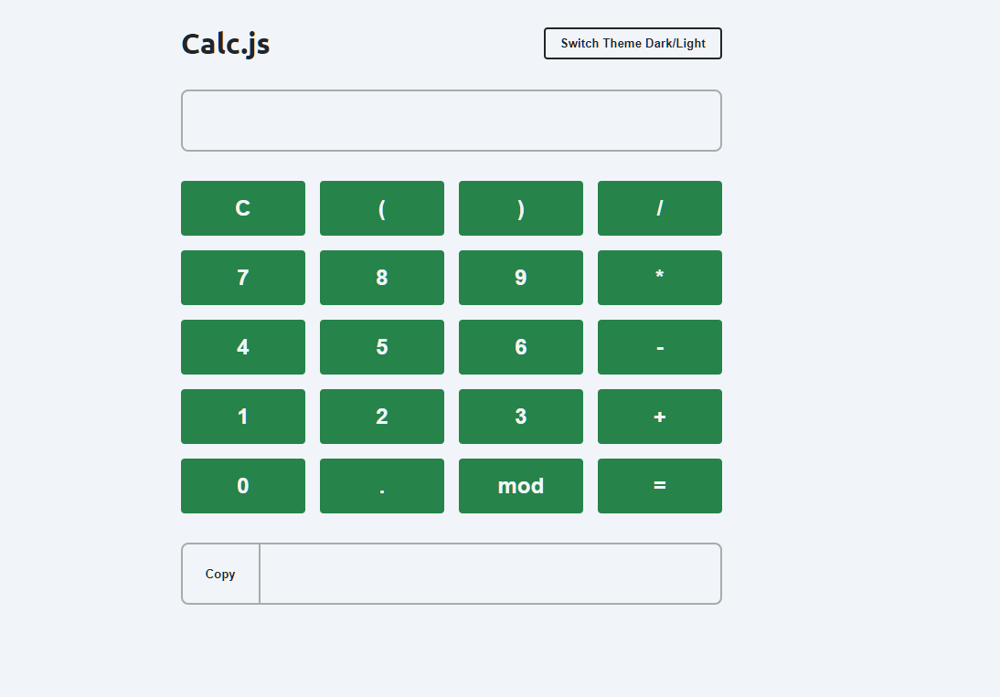
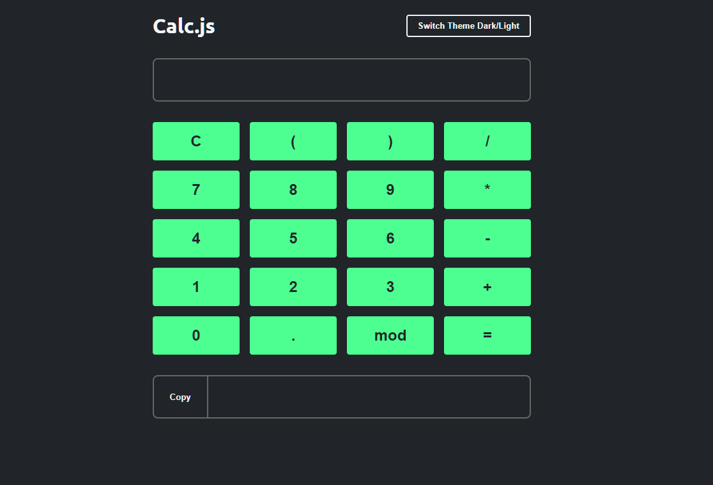

# Calc.js
Calc.js is a fully responsive, dynamic, and functional calculator web page. Made with HTML5, CSS, and JavaScript, this front-end application is able to do any of the four main math operations, such as sum, subtraction, division, and multiplication. 
Besides, Calc.js has many error treatments to prevent user to type unexpected tokens. Also, if it's the case, an error message gonna be displayed showing to the user the exact problem.
The application also has a dark and a light theme, that can be switched by clicking the appropiate button.

### Calc.js 

  

